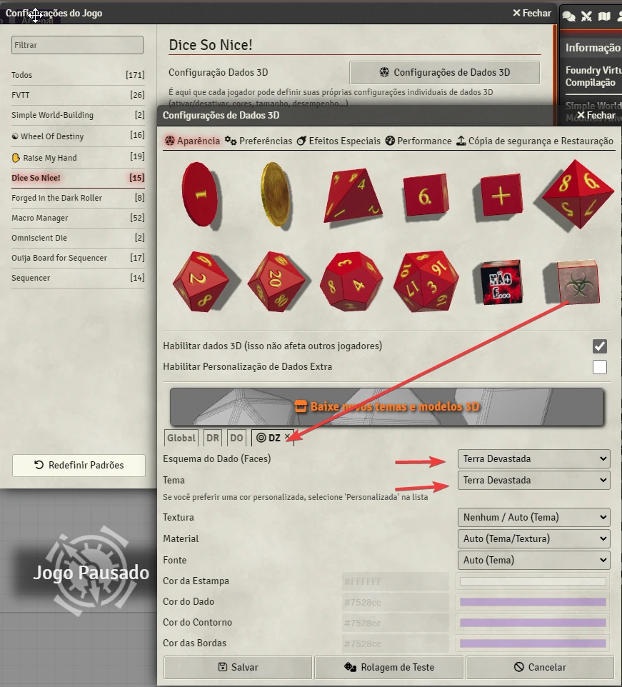

# Terra Devastada - Dados

Dados para jogar o RPG Terra Devastada. Esse RPG pode ser obtido no seguinte [link](https://retropunk.com.br/editora/roleplaying/terra_devastada_edicao_apocalipse).

# Como Usar
1. Nas configurações do Dice so Nice você deve selecionar o dado Terra Devastada. 
2. Então você precisa colocar em *Esquema* e *Tema*: *Terra Devastada*. 
3. Pronto! Agora é só usar 1dz para rolar esse dado.

  

## Exemplos 
Você pode digitar no chat */r 3dz* e apertar enter. Isso vai rolar 3 dados para você.

# Instalação Manual
Se precisar o módulo manualmente, cole o manifesto abaixo na área adequada do seu Foundry VTT para instalar.
https://raw.githubusercontent.com/brunocalado/terra-devastada-dados/main/module.json

# Arte
A arte nos dados foi feita pelo Heber Maia. Metade homem, metade queijo.

# License
This module was created with the permission of Retropunk. Contact at [link](https://retropunk.com.br/editora/contato/).

# Mestre Digital
About this module creator: https://sites.google.com/view/mestredigitalmodules
